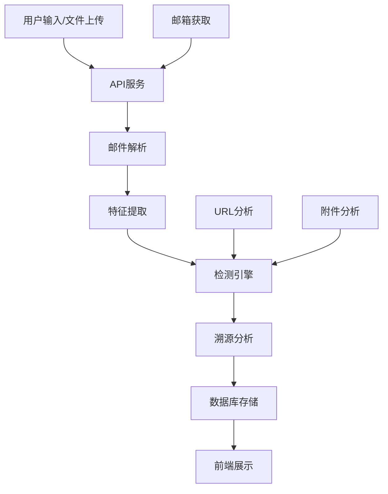

# 面向中小型企业的轻量化钓鱼邮件检测与溯源系统

## 项目文档

### 版本信息
- **文档版本**：1.3.0
- **更新日期**：2026-03-17
- **项目状态**：已完成

## 1. 项目概述

### 1.1 项目背景
随着网络钓鱼攻击的日益增多，中小型企业面临着严峻的网络安全挑战。传统的邮件安全解决方案往往价格昂贵，部署复杂，难以满足中小型企业的需求。本项目旨在开发一个轻量化、易于部署的钓鱼邮件检测与溯源系统，帮助中小型企业有效识别和应对钓鱼邮件威胁。

### 1.2 项目目标
- 开发一个轻量化的钓鱼邮件检测系统，适合中小型企业部署
- 实现高精度的钓鱼邮件检测，支持多维度风险分析
- 提供详细的检测报告和溯源分析
- 支持多种邮件输入方式（手动输入、文件上传、邮箱获取）
- 提供直观的用户界面，方便非技术人员使用

### 1.3 系统特点
- **轻量级**：基于Python和SQLite，部署简单，资源占用低
- **高精度**：采用44维特征向量和LightGBM机器学习模型
- **多功能**：支持邮件检测、URL分析、附件分析、溯源追踪
- **易扩展**：模块化设计，支持功能扩展和定制
- **用户友好**：直观的Web界面，详细的检测报告

## 2. 系统架构

### 2.1 架构概览

本系统采用分层架构设计，主要分为以下几层：

1. **前端层**：基于Vue 3的Web界面
2. **API层**：Flask RESTful API服务
3. **业务逻辑层**：核心检测和分析模块
4. **数据层**：SQLite数据库和文件存储

### 2.2 系统组件

| 组件 | 职责 | 技术 | 位置 |
|------|------|------|------|
| 前端应用 | 用户界面和交互 | Vue 3 + Vite | frontend/ |
| API服务 | 处理HTTP请求 | Flask | src/app.py |
| 邮件解析 | 解析邮件结构 | Python | src/parse_email.py |
| 特征提取 | 提取邮件特征 | Python | src/features.py |
| 检测引擎 | 钓鱼邮件检测 | LightGBM | src/detector.py |
| 溯源分析 | 邮件溯源追踪 | Python | src/email_traceback.py |
| 数据库 | 数据存储 | SQLite | src/utils/database.py |
| 配置管理 | 系统配置 | Python | src/utils/config.py |
| 日志系统 | 操作和错误记录 | Python | src/utils/logging.py |

### 2.3 数据流图



## 3. 功能模块

### 3.1 核心功能

#### 3.1.1 邮件分析
- **功能描述**：分析邮件内容，检测是否为钓鱼邮件
- **输入**：邮件文本或.eml文件
- **输出**：检测结果、风险评分、详细报告
- **实现**：src/app.py中的/api/analyze接口

#### 3.1.2 邮件获取
- **功能描述**：从配置的邮箱服务器获取邮件
- **输入**：邮箱配置（服务器、账号、密码）
- **输出**：未读邮件列表
- **实现**：src/email_fetcher.py和src/app.py中的/api/fetch-emails接口

#### 3.1.3 报告生成
- **功能描述**：生成详细的检测报告
- **输入**：检测结果和分析数据
- **输出**：HTML格式的详细报告
- **实现**：src/app.py中的报告相关接口和前端Report.vue组件

#### 3.1.4 数据统计
- **功能描述**：统计邮件检测数据和趋势
- **输入**：时间范围、过滤条件
- **输出**：统计数据、图表数据
- **实现**：src/app.py中的/api/stats/*接口

### 3.2 辅助功能

#### 3.2.1 系统管理
- **功能描述**：管理系统配置和状态
- **输入**：配置参数
- **输出**：操作结果
- **实现**：src/app.py中的/api/config/*接口

#### 3.2.2 健康检查
- **功能描述**：检查系统健康状态
- **输入**：无
- **输出**：系统状态信息
- **实现**：src/app.py中的/api/health接口

## 4. 技术栈

### 4.1 后端技术

| 技术 | 版本 | 用途 | 来源 |
|------|------|------|------|
| Python | 3.12.4 | 核心编程语言 | 系统环境 |
| Flask | 3.0.3 | Web框架 | requirements.txt |
| SQLite | 内置 | 数据库 | Python标准库 |
| LightGBM | - | 机器学习模型 | requirements.txt |
| email | 内置 | 邮件解析 | Python标准库 |
| html.parser | 内置 | HTML解析 | Python标准库 |

### 4.2 前端技术

| 技术 | 版本 | 用途 | 来源 |
|------|------|------|------|
| Vue.js | 3.x | 前端框架 | frontend/package.json |
| Vite | 6.x | 构建工具 | frontend/package.json |
| Vue Router | 4.x | 路由管理 | frontend/package.json |
| Axios | - | HTTP客户端 | frontend/package.json |

### 4.3 部署技术

| 技术 | 用途 | 来源 |
|------|------|------|
| Docker | 容器化部署 | Dockerfile |
| docker-compose | 多容器管理 | docker-compose.yml |
| batch/shell脚本 | 启动脚本 | start.bat, start.sh |

## 5. 安装与部署

### 5.1 环境要求

- **操作系统**：Windows 10/11或Linux
- **Python**：3.10+
- **Node.js**：16.0+（用于前端构建）
- **内存**：至少4GB
- **存储空间**：至少1GB

### 5.2 安装步骤

#### 5.2.1 后端安装
1. 克隆项目仓库：
   ```bash
   git clone https://github.com/woaishimoxi/pishing_email.git
   cd pishing_email
   ```

2. 安装Python依赖：
   ```bash
   pip install -r requirements.txt
   ```

#### 5.2.2 前端安装
1. 进入前端目录：
   ```bash
   cd frontend
   ```

2. 安装前端依赖：
   ```bash
   npm install
   ```

3. 构建前端项目：
   ```bash
   npm run build
   ```

### 5.3 启动系统

#### 5.3.1 本地启动
- **Windows**：运行 `start.bat`
- **Linux**：运行 `start.sh`

系统将在 `http://localhost:5000` 启动。

#### 5.3.2 Docker启动
1. 构建Docker镜像：
   ```bash
   docker build -t phishing-detector .
   ```

2. 运行容器：
   ```bash
   docker run -p 5000:5000 phishing-detector
   ```

## 6. 使用指南

### 6.1 系统登录
- 打开浏览器，访问 `http://localhost:5000`
- 系统无需登录，直接进入仪表盘

### 6.2 邮件检测

#### 6.2.1 手动输入
1. 在左侧菜单选择「手动输入」
2. 输入邮件主题、发件人、收件人和邮件内容
3. 点击「开始检测」按钮
4. 查看检测结果和详细报告

#### 6.2.2 文件上传
1. 在左侧菜单选择「上传邮件」
2. 点击「选择文件」按钮，选择.eml文件
3. 点击「上传并检测」按钮
4. 查看检测结果和详细报告

#### 6.2.3 邮箱获取
1. 在左侧菜单选择「第三方获取」
2. 点击「配置邮箱」按钮，填写邮箱配置
3. 点击「测试连接」按钮，验证配置是否正确
4. 点击「获取邮件」按钮，获取未读邮件
5. 选择邮件进行检测

### 6.3 报告查看
1. 在检测结果页面，点击「查看报告」按钮
2. 查看详细的检测报告，包括：
   - 基础概览（风险评分、判定结果）
   - 邮件头信息分析
   - 邮件基本信息
   - URL分析
   - 附件分析
   - 溯源信息

### 6.4 数据统计
1. 在左侧菜单选择「统计分析」
2. 查看系统统计数据，包括：
   - 总检测数、钓鱼邮件数、正常邮件数
   - 检测结果分布
   - 检测趋势（日/周）

## 7. API文档

### 7.1 主要API接口

#### 7.1.1 邮件分析
- **URL**：`/api/analyze`
- **方法**：POST
- **参数**：
  - `email`：邮件文本内容
  - `source`：来源（可选）
- **返回**：检测结果和详细分析

#### 7.1.2 邮件上传
- **URL**：`/api/upload`
- **方法**：POST
- **参数**：
  - `file`：.eml文件
- **返回**：检测结果和详细分析

#### 7.1.3 邮箱获取
- **URL**：`/api/fetch-emails`
- **方法**：POST
- **参数**：无（使用配置的邮箱信息）
- **返回**：未读邮件列表

#### 7.1.4 统计数据
- **URL**：`/api/stats/overview`
- **方法**：GET
- **参数**：无
- **返回**：系统概览统计数据

#### 7.1.5 健康检查
- **URL**：`/api/health`
- **方法**：GET
- **参数**：无
- **返回**：系统健康状态

### 7.2 API响应格式

所有API响应采用统一格式：

```json
{
  "success": true,       // 操作是否成功
  "message": "操作成功", // 操作结果消息
  "data": {}            // 返回数据
}
```

## 8. 系统维护

### 8.1 日志管理
- **日志位置**：`logs/`目录
- **日志文件**：`analysis_YYYYMMDD.log`
- **建议**：定期清理日志文件，避免存储空间不足

### 8.2 数据库维护
- **数据库位置**：`data/alerts.db`
- **建议**：定期备份数据库文件

### 8.3 模型更新
- **模型位置**：`models/`目录
- **更新方法**：运行 `train_model.py` 重新训练模型

### 8.4 常见问题

| 问题 | 可能原因 | 解决方案 |
|------|---------|----------|
| API返回500错误 | 缺少依赖或配置错误 | 检查requirements.txt是否安装完整 |
| 前端显示NaN | 后端API错误 | 检查API响应是否正常 |
| 邮件获取失败 | 邮箱配置错误 | 检查邮箱服务器设置和凭证 |
| 检测速度慢 | 邮件内容过大或网络连接慢 | 优化邮件大小或检查网络连接 |

## 9. 安全考虑

### 9.1 系统安全
- **输入验证**：所有用户输入严格验证，防止注入攻击
- **文件上传**：限制文件类型和大小，防止恶意文件上传
- **API安全**：实现请求限流，防止API滥用
- **错误处理**：详细的错误日志，避免敏感信息泄露

### 9.2 数据安全
- **数据库安全**：使用参数化查询，防止SQL注入
- **数据存储**：敏感信息加密存储
- **访问控制**：预留基于角色的访问控制机制

### 9.3 第三方集成安全
- **API密钥管理**：通过配置文件管理第三方API密钥
- **外部服务调用**：使用HTTPS协议，确保通信安全

## 10. 未来扩展

### 10.1 功能扩展
- **多语言支持**：扩展到其他语言的邮件检测
- **实时监控**：邮件流实时监控和预警
- **威胁情报**：集成威胁情报源，提高检测准确率
- **API开放**：提供开放API，支持与其他系统集成

### 10.2 性能优化
- **分布式处理**：支持分布式邮件分析
- **缓存机制**：优化URL和附件分析缓存
- **并行处理**：支持多线程并行分析

### 10.3 集成扩展
- **邮件服务器集成**：直接集成到邮件服务器
- **安全设备集成**：与防火墙、安全网关集成
- **SIEM集成**：与安全信息事件管理系统集成

## 11. 总结

本项目成功实现了一个面向中小型企业的轻量化钓鱼邮件检测与溯源系统。系统采用分层架构设计，模块化组织代码，具有以下优势：

- **轻量级**：基于Python和SQLite，部署简单，资源占用低
- **高精度**：采用44维特征向量和LightGBM机器学习模型，检测准确率高
- **多功能**：支持邮件检测、URL分析、附件分析、溯源追踪等多种功能
- **易扩展**：模块化设计，支持功能扩展和定制
- **用户友好**：直观的Web界面，详细的检测报告
- **安全可靠**：多重安全措施，保障系统和数据安全

系统已完全实现并成功部署，可以为中小型企业提供有效的钓鱼邮件防护解决方案。